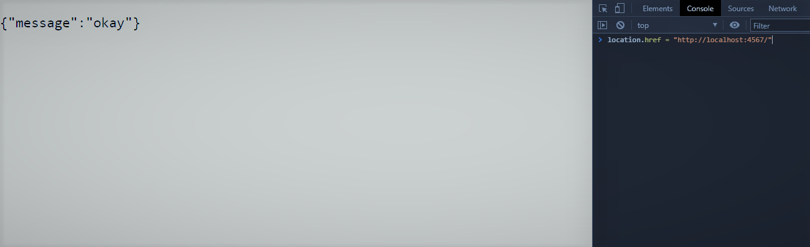

# :rocket: Rocketseat Bootcamp

## Consumindo API no Front e no Back-end | CodeDrops #45

https://www.youtube.com/watch?v=vYlz3SmNXQQ&t=32s  
___
## API

**Criar uma API:**  

1. Iniciar o projeto na pasta ```consuming-api```

        npm init -y


2. Instalar as dependências

        npm i express nodemon cors axios

3. Criar uma rota para acessar a API 

criar o arquivo ```server.js```  

```
const express = require('express')
const app = express()

app.get('/', (request, response) => {
    return response.json({
        message: 'okay'
    })
})

app.listen('4567')
```

rodar o arquivo ```server.js```  

```
node server.js
```

abrir o navegador, digitar o endereço http://localhost:4567/, clicar com o botão direito do mouse e selecionar a opção "Inspect"  

selecionar o item "Console"  

no console, digitar:

```
location.href = "http://localhost:4567/"
```

será exibido:  
___

___

4. Servir a API

5. Habilitar o [CORS](https://github.com/expressjs/cors#readme)

6. Habilitar o [nodemon](https://nodemon.io/) para reiniciar o server

___
## Front-end

**Consumir uma API:**  

1. Utilizar [Fetch API](https://developer.mozilla.org/en-US/docs/Web/API/Fetch_API) para consumir nossa API backend

2. [Promise](https://developer.mozilla.org/en-US/docs/Web/JavaScript/Reference/Global_Objects/Promise)

3. [async/await](https://developer.mozilla.org/en-US/docs/Web/JavaScript/Reference/Statements/async_function)

4. Usar [try...catch](https://developer.mozilla.org/en-US/docs/Web/JavaScript/Reference/Statements/try...catch)

5. Mostrar a resposta na tela

___
## Back-end

**Consumir uma API:**  

1. [JSONPlaceholder](https://jsonplaceholder.typicode.com/)

2. Usar [axios](https://axios-http.com/)

3. Semelhancas entre [axios](https://axios-http.com/) e [Fetch API](https://developer.mozilla.org/en-US/docs/Web/API/Fetch_API)

4. Usar [try...catch](https://developer.mozilla.org/en-US/docs/Web/JavaScript/Reference/Statements/try...catch)
