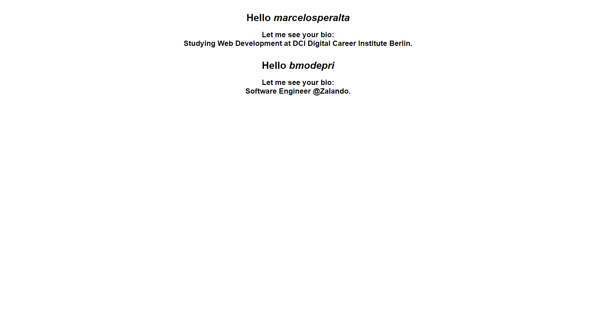

# :rocket: Rocketseat Bootcamp

## [Axios](https://github.com/axios/axios) - um cliente HTTP Full Stack

by [Thiago Marinho](https://github.com/tgmarinho)  

https://blog.rocketseat.com.br/axios-um-cliente-http-full-stack/  

### Related topics

[XMLHttpRequest](https://developer.mozilla.org/pt-BR/docs/Web/API/XMLHttpRequest)  

[Node.js HTTP](https://nodejs.org/api/http.html)  

[Promise](https://developer.mozilla.org/en-US/docs/Web/JavaScript/Reference/Global_Objects/Promise)  

[XRSF](https://en.wikipedia.org/wiki/Cross-site_request_forgery)  

### Install

```
npm install axios
```

or  

```
yarn add axios
```

### Sandbox

https://codesandbox.io/s/trying-axios-8ezy1?from-embed=&file=/public/index.html

### Screenshot (run from "./axios/axios")

  