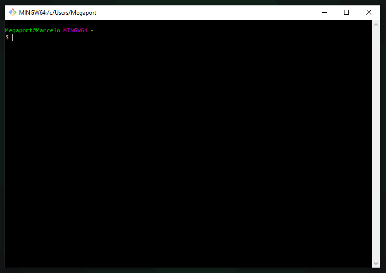
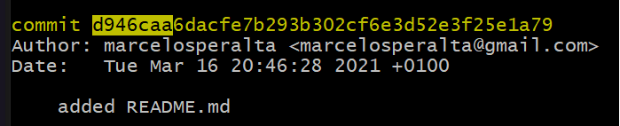

# GIT  

[Version control systems (VCS)](https://git-scm.com/book/en/v2/Getting-Started-About-Version-Control)  

[SHA-1 (Secure Hash Algorithm 1)](https://en.wikipedia.org/wiki/SHA-1)  

[DAG](https://en.wikipedia.org/wiki/Directed_acyclic_graph)  

## Using **Git Bash**  



### Configuration:  
```
git config --global user.name "Your full name"
git config --global user.email "Your email"
```

### Change Git standar editor:  
```
git config --global core.editor "code -w"
```

### See configurations:  
```
git config --list`
```
```
cat ~/.gitconfig
```

### Git config file path on Windows:  
```
C:/Users/<user>/.gitconfig
```

### Create a folder:  
```
mkdir git
```
```
cd git
```

### Start a repository:  
```
git init
```
```
ls -a
```
```
cd .git
```
```
ls
```
```
cat config
```
```
git config --list
```

### Git Help:  
```
git help
```

### Git Log:  
```
git log
```
```
git log -n 5
```
```
git log -n 20
```
```
git log --since=2021-01-01
```
```
git log --until=2021-01-01
```
```
git log --author=Marcelo
```
```
git log --grep="init"
```
```
git log --grep="bug fix"
```

### VIM:  
```
vim file.txt
```
- Write something  
- Press "Esc"  
```
:wq
```
_wq = write and quit_

### Commit:  
```
git add .
```
```
git commit -m "initial commit"
```

### Recap:  
```
mkdir git-test
```
```
cd git-test
```
```
git init
```
```
touch file1.txt
```
```
git status
```
```
touch file2.txt
```
```
git status
```
```
git add file1.txt
```
```
git status
```
```
git add .
```
```
git status
```
```
git rm --cached file2.txt
```
```
git status
```
```
git commit -m "initial commit"
```
```
clear
```
```
git log
```
```
git add file2.txt
```
```
git commit -m "second commit"
```
```
git log
```
```
vim file1.txt
```
```
git status
```
```
git add file1.txt
```
```
git commit -m "file1.txt changed"
```
```
git log
```

### Changing files  

**add:**  
```
touch README.md
```
```
git status
```
```
vim README.md
```
```
vim file1.txt
```
```
git add README.md
```
```
git status
```
```
git commit -m "added README.md"
```
```
clear
```
```
git log
```
```
git status
```
```
git add *.md
```

**edit:**  
```
vim file1.txt
```
```
vim file2.txt
```
```
vim README.md
```
```
git status
```
```
git add .
```
```
git commit -m "all files modified"
```

#### **[diff](https://pubs.opengroup.org/onlinepubs/9699919799/utilities/diff.html)**

```
rm file1.txt
```
```
rm file2.txt
```
```
touch repository_local.md
```
```
touch stage_area.md
```
```
touch working_directory.md
```
```
vim README.md
```

**comparing files** 

```
git status
```
```
git diff
```

**diff staged** 

```
git add README.md
```
```
git diff
```
```
git diff --staged
```

**delete** 

```
touch file1.txt
```
```
git status
```
```
git add file2.txt
```
```
git status
```
```
git restore --staged README.md
```
```
git status
```
```
git commit -m "delete file2.txt"
```
```
git status
```
```
git rm file1.txt
```
```
git status
```
```
git commit -m "remove file1.txt"
```
```
git status
```

**rename** 

```
git status
```
```
git add .
```
```
git commit -m "files added"
```
```
git status
```
```
git mv stage_area.md 2-stage_area.md
```
```
git status
```
```
git mv repository_local.md 3-repository_local.md
```
```
git status
```
```
git commit -m "renamed"
```
```
git status
```

**move** 

```
mkdir sub
```
```
git status
```
```
git mv README.md sub/README.md
```
```
git status
```

**undo**  

```
vim 3-repository_local.md
```
```
cat 3-repository_local.md
```
```
git status
```
```
git restore 3-repository_local.md
```
```
cat 3-repository_local.md
```

**return from stage**  

```
vim 3-repository_local.md
```
```
git add .
```
```
git status
```
```
git restore --staged 3-repository_local.md
```
```
git status
```
_or_  
```
git add .
```
```
git status
```
```
git reset HEAD 3-repository_local.md
```
```
git status
```
_all_  
```
vim 2-repository_local.md
```
```
vim 3-repository_local.md
```
```
git status
```
```
git add .
```
```
git status
```
```
git restore --staged .
```
```
git status
```
```
git add .
```
```
git status
```
```
git reset HEAD .
```
```
git status
```
```
git restore .
```
```
git status
```

**fixing the last commit**

```
git log
```
```
git commit --amend -m "test"
```
```
git log
```
```
vim 2-repository_local.md
```
```
git status
```
```
git add .
```
```
git commit --amend -m "modify 2-repository_local.md"
```
```
git status
```
```
ls -al
```

**recover**

```
vim working_directory.md
```
```
git add working_directory.md
```
```
git commit -m "working_directory.md updated"
```
```
git log
```
_copy the first letters of the commit that you like to restore_  
e.g.


```
git checkout d946caa -- README.md
```
```
git status
```
```
vim README.md
```
```
vim working_directory.md
```
```
git restore --staged README.md
```
```
git add working_directory.md
```
```
git status
```
```
git commit -m "working_directory.md updated"
```
```
rm README.md
```

**remove untracked files**

```
touch trash1.txt trash2.txt
```
```
git status
```
```
git clean -f
```
```
git status
```


```

```
```

```
```

```
```

```
```

```
```

```
```

```
```

```
```

```