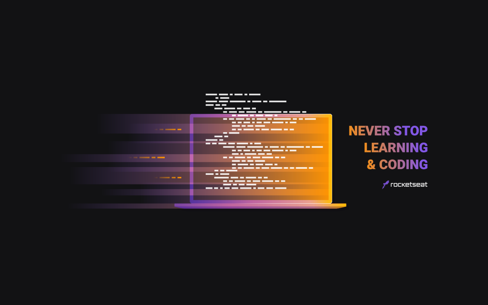

:link: _front-end version:_ ...

:link: _fullstack version:_ ...

# E-learning platform mock-up

A finance app using **[HTML](https://whatwg.org/)**, **[CSS](https://www.w3.org/Style/CSS/)**, **[JavaScript](https://developer.mozilla.org/en-US/docs/Web/JavaScript)**, and **[Node.js](https://nodejs.org/)**.  

 

&nbsp;

&nbsp;
&nbsp;

 

## :mortar_board: **_bootcamp:_**  

### [Rocketseat](https://rocketseat.com.br/)

#### [Maratona Discover](https://maratonadiscover.rocketseat.com.br/)

with [Mayk Brito](https://github.com/maykbrito)  

 

## :camera: **_screenshots:_**  

### :iphone:  

  

### :computer:  

  

  

  
 