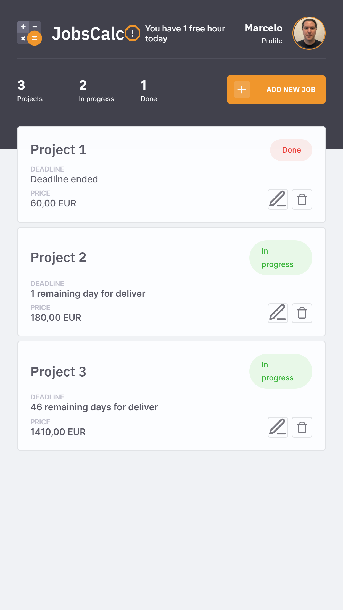
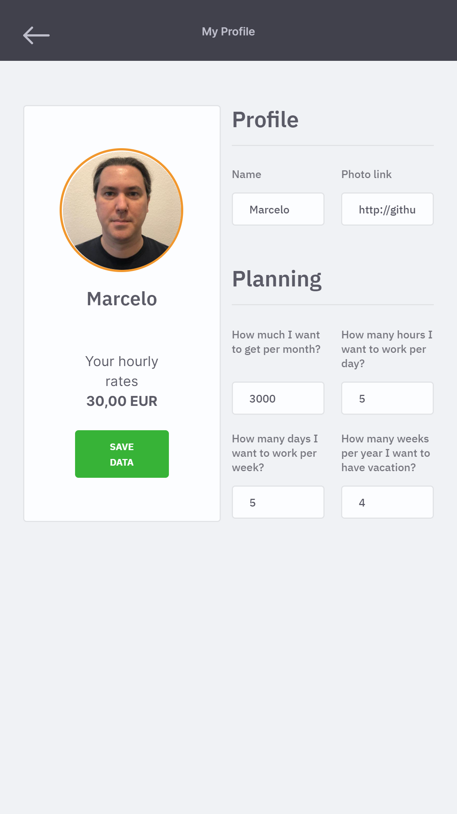

# JobsCalc App

An app to help freelancers to calculate how much they should charge for your services using **[HTML](https://whatwg.org/)**, **[CSS](https://www.w3.org/Style/CSS/)**, **[JavaScript](https://developer.mozilla.org/en-US/docs/Web/JavaScript)**, **[Node.js](https://nodejs.org/)**, **[Express](https://expressjs.com/)**, and **[SQLite](https://www.sqlite.org/)**.  

<br>

<div align="center">
    
        &nbsp;
    
        &nbsp;
        &nbsp;
    
        &nbsp;
        &nbsp;
    
        &nbsp;
        &nbsp;
    
        &nbsp;
    
</div>

<br>

## :mortar_board: **_bootcamp:_**  

### [Rocketseat](https://rocketseat.com.br/)

#### [Maratona Discover #2](https://maratonadiscover.rocketseat.com.br/)

with [Mayk Brito](https://github.com/maykbrito) and [Jakeliny Gracielly](https://github.com/jakeliny)  

_rocketseat-education repo:_ https://github.com/rocketseat-education/maratona-discover-02


<br>

## :camera: **_screenshots:_**  

### :iphone:  

<div>
    
        &nbsp;
    
</div>

### :computer:  

  

## :computer: **_app:_**  

### install

```
npm init -y
```

```
npm i express
```

```
npm i nodemon -D
```

```
npm i ejs
```

```
npm i sqlite3
```

```
npm i sqlite
```

### tests

```
node src/server.js
```

```
http://localhost:3000/
```

### create tables using SQLite (database.sqlite)

```
npm run init-db
```

### run

```
npm i
```

```
npm run dev
```

## :hammer: **_tools_**

[EJS - Embedded JavaScript templating](https://ejs.co/)  

[Beekeeper Studio](https://www.beekeeperstudio.io/)  

**_Visual Sudio Code extension_**  

[EJS language support](https://marketplace.visualstudio.com/items?itemName=DigitalBrainstem.javascript-ejs-support)  

## :newspaper: **_articles_**

[Spread syntax (...)](https://developer.mozilla.org/en-US/docs/Web/JavaScript/Reference/Operators/Spread_syntax)  

[Template engine](https://en.wikipedia.org/wiki/Template_processor)  

[Using template engines with Express](https://expressjs.com/en/guide/using-template-engines.html)  

[Object literals](https://developer.mozilla.org/en-US/docs/Web/JavaScript/Guide/Grammar_and_types#object_literals)  

[Optional chaining](https://developer.mozilla.org/en-US/docs/Web/JavaScript/Reference/Operators/Optional_chaining)  

[Model–view–controller pattern (MVC pattern)](https://en.wikipedia.org/wiki/Model%E2%80%93view%E2%80%93controller)  

[Code refactoring](https://en.wikipedia.org/wiki/Code_refactoring)  