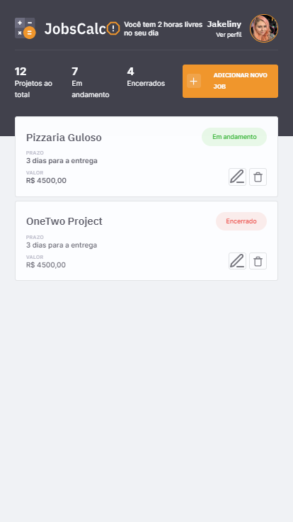
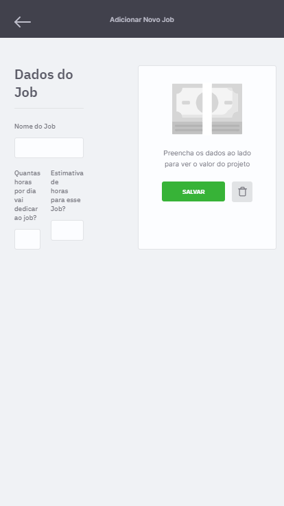
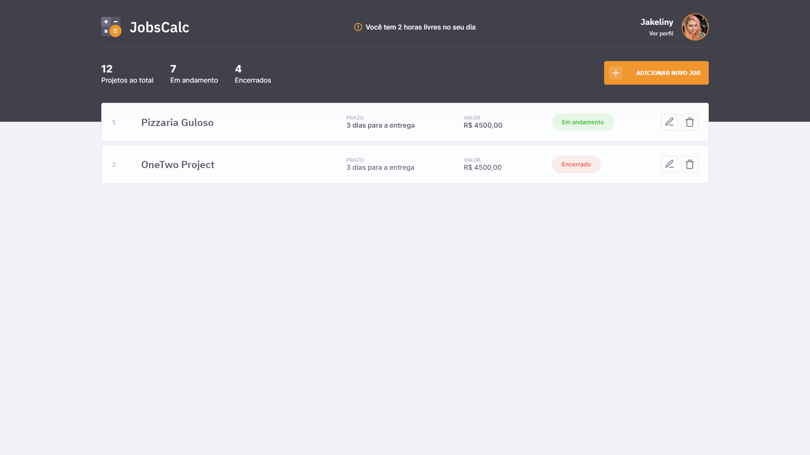

:link: _front-end version:_ ...

:link: _fullstack version:_ ...

# JobsCalc App

An app to help freelancers to calculate how much they should charge for your services using **[HTML](https://whatwg.org/)**, **[CSS](https://www.w3.org/Style/CSS/)**, **[JavaScript](https://developer.mozilla.org/en-US/docs/Web/JavaScript)**, **[Node.js](https://nodejs.org/)**, and **[Express](https://expressjs.com/)**.  

<br>

<div align="center">

&nbsp;

&nbsp;
&nbsp;

&nbsp;
&nbsp;

&nbsp;
&nbsp;

</div>

<br>

## :mortar_board: **_bootcamp:_**  

### [Rocketseat](https://rocketseat.com.br/)

#### [Maratona Discover](https://maratonadiscover.rocketseat.com.br/)

with [Mayk Brito](https://github.com/maykbrito) and [Jakeliny Gracielly](https://github.com/jakeliny)  


<br>

## :camera: **_screenshots:_**  

### :iphone:  

<div>
    
    
</div>

### :computer:  

  

## :computer: **_app:_**  

### install

```
npm init -y
```

```
npm i express
```

### tests

```
node src/server.js
```

```
http://localhost:3000/
```

### install

```
npm i nodemon -D
```

### run

```
npm run dev
```

### install

```
npm i nodemon -D
```

## :hammer: **_tools_**

[EJS - Embedded JavaScript templating](https://ejs.co/)  

## :newspaper: **_articles_**

[Using template engines with Express](https://expressjs.com/en/guide/using-template-engines.html)  