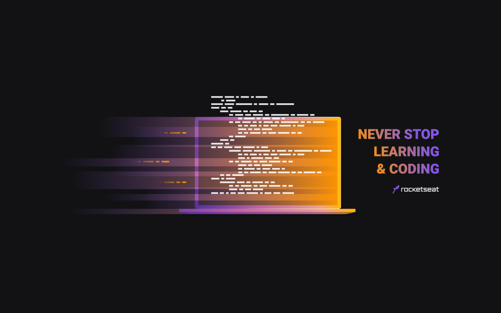

:link: _front-end version:_ ...

:link: _fullstack version:_ ...

# JobsCalc App

An app to help freelancers to calculate how much they should charge for your services using **[HTML](https://whatwg.org/)**, **[CSS](https://www.w3.org/Style/CSS/)**, **[JavaScript](https://developer.mozilla.org/en-US/docs/Web/JavaScript)**, and **[Node.js](https://nodejs.org/)**.  

<br>

<div align="center">

&nbsp;

&nbsp;
&nbsp;

&nbsp;
&nbsp;

</div>

<br>

## :mortar_board: **_bootcamp:_**  

### [Rocketseat](https://rocketseat.com.br/)

#### [Maratona Discover](https://maratonadiscover.rocketseat.com.br/)

with [Mayk Brito](https://github.com/maykbrito) and [Jakeliny Gracielly](https://github.com/jakeliny)  


<br>

## :camera: **_screenshots:_**  

### :iphone:  

  

### :computer:  

  

## install

```
npm init -y
```

```
npm i express
```

## tests

```
node src/server.js
```

```
http://localhost:3000/
```

## install

```
npm i nodemon -D
```

```
```

```
```

```
```

```
```