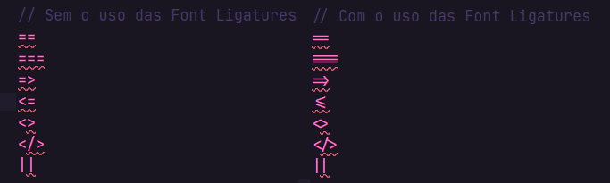
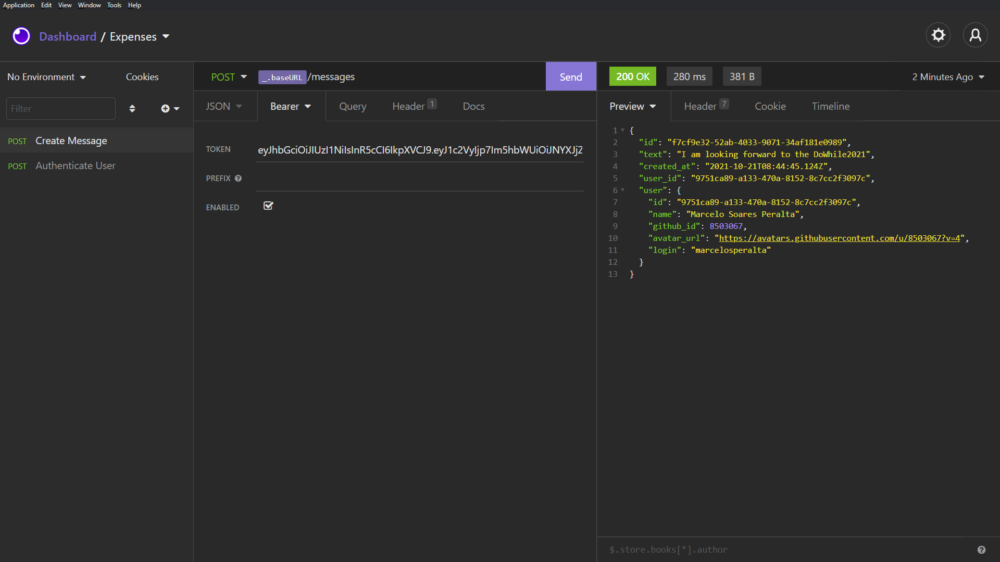
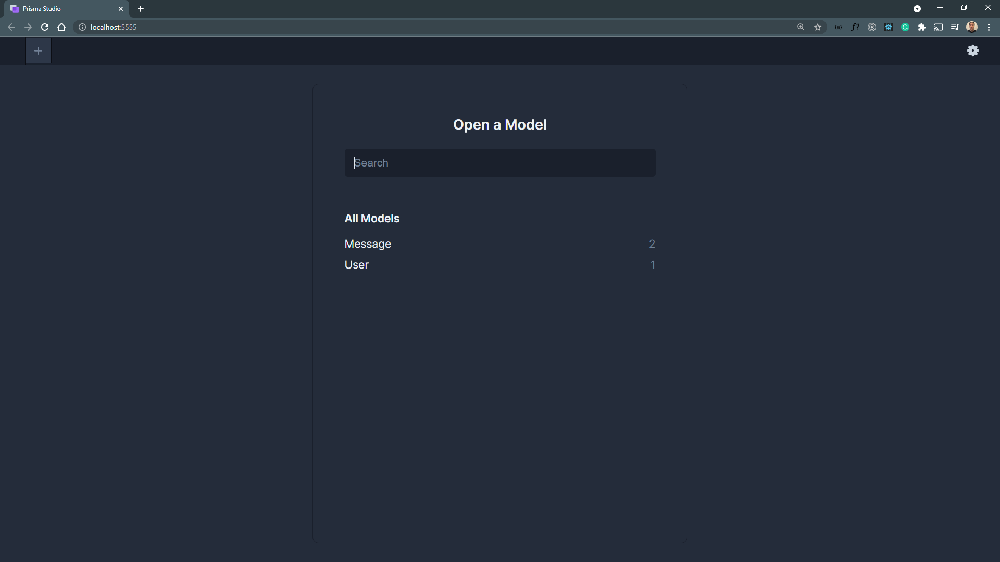
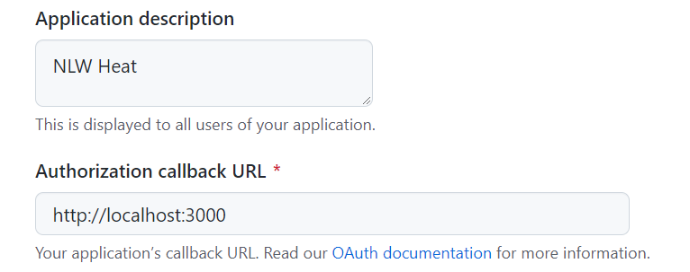

# [Next Level Week 07](https://nextlevelweek.com/)

## Table of Contents:

- [Overview](https://github.com/marcelosperalta/bootcamp_rocketseat/tree/master/nlw_07#nlw-heat---mission-impulse)
- [Stage 1](https://github.com/marcelosperalta/bootcamp_rocketseat/tree/master/nlw_07#stage-1---18102021---backend---nodejs-instructor-daniele-evangelista)
- [Stage 2](https://github.com/marcelosperalta/bootcamp_rocketseat/tree/master/nlw_07#stage-2---19102021---react-instructor-diego-fernandes)
- [Stage 3]()
- [Stage 4]()
- [Stage 5]()

## NLW Heat - _Mission:_ Impulse

**_tech stack:_**  

- **Node.js**
  - Express
  - GitHub OAuth
  - Typescript
  - ts-node-dev
  - dotenv
  - axios
  - jsonwebtoken
  - Prisma
  - Socket.IO
  - corrs
- **React**
  - Vite
    - CSS Modules
  - Typescript
  - Sass
  - React Icons
  - axios
- **React Native**
- **Elixir**
- **SQLite**

**_tools:_**  

- [Insomnia](https://insomnia.rest/)

**_app name:_**  

- DoWhile2021  

**_app version:_**  

- desktop

**_app description:_**  

- People can share their expectations about the _[DoWhile2021](https://dowhile.io/)_ event.

**_app features:_** 

- authentication using GitHub

**_app screenshot:_**  

_desktop version:_

-   

## [Environment](https://efficient-sloth-d85.notion.site/NLW-Heat-daaa092e1eeb42ff929151d2807c8231)

- Visual Studio Code
- Node + NPM
- Yarn
- [JetBrains Mono](https://www.jetbrains.com/lp/mono/)
- [Omni Theme](https://marketplace.visualstudio.com/items?itemName=rocketseat.theme-omni)
- [Material Icon Theme](https://marketplace.visualstudio.com/items?itemName=PKief.material-icon-theme)
- [Prisma](https://marketplace.visualstudio.com/items?itemName=Prisma.prisma)
- [Prisma - Insider](https://marketplace.visualstudio.com/items?itemName=Prisma.prisma-insider)

### Visual Studio Code: _Prisma_ and _Prisma - Insider_

`settings.json`  

```
{
  ...,
  "[prisma]": {
    "editor.defaultFormatter": "Prisma.prisma"
  }
}
```

### update [Node.js](https://nodejs.org/en/)

https://nodejs.org/en/  

```
node -v
```

### update [NPM](https://www.npmjs.com/package/npm)

```
npm install npm@latest -g
```

```
npm -v
```

### update [Yarn](https://yarnpkg.com/)

```
yarn set version latest
```

```
npm -v
```

## App Layout

https://www.figma.com/community/file/1031699316177416916  

## Font Ligatures

  

## Visual Studio Code configuration

``Ctrl + Shift + P``  

``Open Settings (JSON)``  

É preciso tomar alguns cuidados ao realizar essas alterações. Verifique se a configuração adicionada já não existe no arquivo. Se sim, apenas atualize o valor.   

Verifique também se a todas as linhas de configuração exceto a última terminam com vírgula, para não gerar erro.  

Por fim, caso queira substituir completamente a sua configuração pela abaixo, envolva com chaves ``{}`` todo o código disponibilizado.  

_JSON_  
```
  // Configurações da fonte JetBrains Mono
  "editor.fontFamily": "JetBrains Mono",
  "editor.fontLigatures": true,

  // Demais configurações
  "workbench.colorTheme": "Omni",
  "workbench.iconTheme": "material-icon-theme",
  "workbench.startupEditor": "newUntitledFile",

  "explorer.compactFolders": false,
  "editor.renderLineHighlight": "gutter",
  "workbench.editor.labelFormat": "short",
  "extensions.ignoreRecommendations": true,

  "javascript.updateImportsOnFileMove.enabled": "always",
  "typescript.updateImportsOnFileMove.enabled": "never",

  "breadcrumbs.enabled": true,
  "editor.parameterHints.enabled": false,
	"editor.formatOnSave": true,
  "explorer.confirmDragAndDrop": false,
  "explorer.confirmDelete": false,
  
  "emmet.syntaxProfiles": { "javascript": "jsx" },
  "emmet.includeLanguages": { "javascript": "javascriptreact" },

  "javascript.suggest.autoImports": true,
  "typescript.suggest.autoImports": true,
```

<hr />

## Stage 1 - 18.10.2021 - Backend - Node.js _(Instructor: [Daniele Evangelista](https://github.com/danileao))_

:octocat: https://github.com/rocketseat-education/nlw-heat-node  

### topics

- Create project;
- _Express_, _Prisma (ORM)_, _TypeScript_ installation;
- _GitHub OAuth_ configuration;
- GitHub login route creation;
- Callback route creation;
- User authentication;
- Message registration;
- WebSocket configuration;
- Returning the last three messages;
- User profile creation.

### :file_folder: **folder**

`backend`

:black_medium_square: _install_  

```
yarn init -y
```

```
yarn add express
```

```
yarn add -D @types/express typescript ts-node-dev
```

```
yarn tsc --init
```

``backend/tsconfig.json`` configuration:  

````
{
  "compilerOptions": {
    "target": "es2017",                         // <=====
    "module": "commonjs",
    "esModuleInterop": true,
    "forceConsistentCasingInFileNames": true,
    "strict": false,                            // <=====
    "skipLibCheck": true
  }
}
````

`backend/package.json` configuration:  

````
....
  "scripts": {
    "dev": "ts-node-dev src/app.ts"
  },
....
````

````
{
  "name": "backend",
  "version": "1.0.0",
  "main": "index.js",
  "license": "MIT",
  "scripts": {
    "dev": "ts-node-dev src/app.ts"
  },
  "dependencies": {
    "express": "^4.17.1"
  },
  "devDependencies": {
    "@types/express": "^4.17.13",
    "ts-node-dev": "^1.1.8",
    "typescript": "^4.4.4"
  }
}
````

:black_medium_square: _start_  

```
cd backend
```

```
yarn dev
```

:black_medium_square: _install **[Prisma](https://www.prisma.io/)**:_  

_[relational databases](https://www.prisma.io/docs/getting-started/setup-prisma/add-to-existing-project/relational-databases-typescript-postgres)_  

```
yarn add prisma -D
```

```
yarn add @prisma/client
```

```
yarn prisma init
```

file ``backend/package.json``

_add ``--exit-child``_ 

```
...
  "scripts": {
    "dev": "ts-node-dev --exit-child src/app.ts"
  },
...
```

file `backend/prisma/schema.prisma`  

````
datasource db {
  provider = "sqlite"
  url      = "file:./dev.db"
}
````

**_GitHub OAuth_ configuration**  

https://github.com/settings/developers  

https://github.com/settings/applications/new  

_Homepage URL:_  

http://localhost:4000  

_Authorization callback URL:_  

http://localhost:4000/signin/callback  

_Client secrets:_

_Press_ "Generate a new client secret"  

:rotating_light: Make sure to copy your new client secret now. You won’t be able to see it again. :rotating_light:

file `backend/.env` for [SQLite](https://www.prisma.io/docs/concepts/database-connectors/sqlite)  

````
GITHUB_CLIENT_ID=<GitHub_OAuth_Client_ID>
GITHUB_CLIENT_SECRET=<GitHub_OAuth_Client_secrets>
````

**Simulating Front End and Mobile for tests**  

file `backend/src/app.ts`  

````
...
app.get("/github", (request, response) => {
    response.redirect(`https://github.com/login/oauth/authorize?client_id=${process.env.GITHUB_CLIENT_ID}`);
});
...
````

:black_medium_square: _install **[dotenv](https://github.com/motdotla/dotenv)**:_  

file ``backend/src/app.ts``  

``Dotenv`` is a zero-dependency module that loads environment variables from a ``.env`` file into ``process.env``. Storing configuration in the environment separate from code is based on **The Twelve-Factor App** methodology.  

```
yarn add dotenv
```

:black_medium_square: _start:_  

```
cd backend
```

```
yarn dev
```

http://localhost:4000/github  

**Callback route (URL) creation**  

file ``backend/src/app.ts``  

```
...
app.get("/signin/callback", (request, response) => {
    const { code } = request.query;
    return response.json(code);
});
...
```

http://localhost:4000/github  

**User authentication**  

file ``backend/src/services/AuthenticateUserService.ts``  

file ``backend/src/controllers/AuthenticateUserController.ts``  

file ``backend/src/routes.ts``  

file ``backend/src/app.ts``  

:black_medium_square: _install **axios**:_  

```
yarn add axios
```

```
yarn add @types/axios -D
```

:black_medium_square: _using [Insomnia](https://insomnia.rest/):_

Insomnia > No Environment > Manage Environments > Base Environment  

```
{
  "baseURL": "http://localhost:4000"
}
```


Insomnia > New Request > "Authenticate User" > POST > JSON

``/authenticate``

```
{
	"code": "<github_code>"
}
```
e.g. ``http://localhost:4000/signin/callback?code=<github_code>``


_after trying to send it, if:_

````
{
  "error": "bad_verification_code",
  "error_description": "The code passed is incorrect or expired.",
  "error_uri": "https://docs.github.com/apps/managing-oauth-apps/troubleshooting-oauth-app-access-token-request-errors/#bad-verification-code"
}
````

_generate a new code:_  

http://localhost:4000/github  

_copy the new code and paste here:_  

  

_success scenario:_  

  

_install [jsonwebtoken](https://github.com/auth0/node-jsonwebtoken):_  

```
yarn add jsonwebtoken
```

```
yarn add @types/jsonwebtoken -D
```

_generate a new code:_  

http://localhost:4000/github  

_and send again using insomnia (success scenario):_  

  

add to the file ``backend/prisma/schema.prisma``  

```
...
model User {
  id          String @id @default(uuid())
  name        String
  github_id   Int
  avatar_url  String
  login       String

  @@map("users")
}
```

and run:  

```
yarn prisma migrate dev
```

will be created:  

  

afeter ``backend/src/services/AuthenticateUserService.ts`` configurations  

```
yarn dev
```

_generate a new code:_  

http://localhost:4000/github  

_and send again using insomnia (success scenario):_  

  

**Message registration**  

file ``backend/src/services/CreateMessageService.ts``  

file ``backend/src/controllers/CreateMessageController.ts``  

file ``backend/src/routes.ts``  

file ``backend/src/middleware/ensureAuthenticated.ts`` 

file ``backend/src/@types/express/index.d.ts``

add to the file ``backend/tsconfig.json``

```
{
  "compilerOptions": {
    ...,
    "typeRoots": ["./src/@types", "node_modules/@types"]
  }
}
```

add to the file ``backend/prisma/schema.prisma``  

```
...
model Message {
  id          String   @id @default(uuid())
  text        String
  created_at  DateTime @default(now())

  user User   @relation(fields: [user_id], references: [id])

  user_id     String // relation
  @@map("messages")
}
```

and run:  

```
yarn prisma migrate dev
```

```
yarn dev
```

Insomnia > New Request > "Create Message" > POST > JSON   

```
{
	"message": "I am looking forward to the DoWhile2021"
}
```


Insomnia > POST "Create Message" > Auth > Bearer Token  

``/messages``

user the token from  POST "Authenticate User"  

POST "Create Message" Send  



run Prisma Studio:  

```
yarn prisma studio
```




**WebSocket configuration:**

file ``backend/src/app.ts``  

file ``backend/src/server.ts``  

file ``backend/src/services/CreateMessageService.ts``

https://socket.io/  

```
yarn add socket.io
```

```
yarn add @types/socket.io -D
```

https://github.com/expressjs/cors  

```
yarn add cors
```

```
yarn add @types/cors -D
```

CDN Socket Client:  

add to the file `backend/public/index.html`  

```
<script
  src="https://cdnjs.cloudflare.com/ajax/libs/socket.io/4.0.1/socket.io.min.js"
  integrity="sha512-eVL5Lb9al9FzgR63gDs1MxcDS2wFu3loYAgjIH0+Hg38tCS8Ag62dwKyH+wzDb+QauDpEZjXbMn11blw8cbTJQ=="
  crossorigin="anonymous"
></script>
```

change the ``package.json`` configuration  

from:  
```
...
  "scripts": {
    "dev": "ts-node-dev --exit-child src/app.ts"
  },
...
```

to:  
```
...
  "scripts": {
    "dev": "ts-node-dev --exit-child src/server.ts"
  },
...
```

run the app in the terminal:  

```
yarn dev
```

open the ``index.html`` using a web browser and send a message using **Insomnia**:  

  

**Returning the last three messages:**  

file `backend/src/services/GetLast3MessagesService.ts`  

file `backend/src/controllers/GetLast3MessagesController.ts`  

file ``backend/src/routes.ts``  

Insomnia > New Request > "Get last 3 messages" > GET  

``/messages/last3``  

GET "Get last 3 messages" Send  

  

**User profile creation:**  

file `backend/src/services/ProfileUserService.ts`  

file `backend/src/controller/ProfileUserController.ts`  

file ``backend/src/routes.ts``  

Insomnia > New Request > "User Profile" > GET  

``/profile``  

Insomnia > GET "User Profile" > Auth > Bearer Token  

use the token used on POST "Create Message"  


GET "User Profile" Send  

  

**Insomnia** > _Storing the token in one variable:_  

Insomnia > Manage Environments > Base Environment

```
{
  "baseURL": "http://localhost:4000",
  "token": "response"
}
```

  

  

  

adding to GET "User Profile" > Bearer  

  

  

<hr />

## Stage 2 - 19.10.2021 - React _(Instructor: [Diego Fernandes](https://github.com/diego3g))_

 :octocat: https://github.com/rocketseat-education/nlw-heat-web  

### :file_folder: **folder**

`web`

:black_medium_square: _install [Vite](https://vitejs.dev/):_  

```
yarn create vite web --template react-ts
```

```
cd web
```

```
yarn
```

:black_medium_square: _run:_  


```
yarn dev
```

http://localhost:3000/  

:black_medium_square: _install Sass:_  

```
yarn add sass
```

:black_medium_square: _install [React Icons](https://react-icons.github.io/react-icons/):_  

```
yarn add react-icons
```

:black_medium_square: run _Backend_ and _Frontend_:_  

```
cd backend
```

```
yarn dev
```

http://localhost:4000/  

```
cd web
```

```
yarn dev
```

http://localhost:3000/  

:black_medium_square: **integrating** _Backend and Frontend:_  

- create the ``services`` folder with the ``api.ts`` file  

- install `axios`  

  - ```
    yarn add axios
    ```

- configure the ``web/src/components/MessageList/index.ts`` file  

- configure the ``web/src/components/LoginBox/index.ts`` file  

  - Be sure that your GitHub OAuth (Settings > Developer Settings > OAuth Apps) is configured like that: 

  - _needs to be the same URL used by React_  

  - 

  - If the login was successful, you will see the "client ID" on the URL:  

    - e.g. http://localhost:3000/?code=272506f1b7849abc8430


<hr />

## Stage 3 - 20.10.2021 - _(Instructor: []())_ 

### :file_folder: **folder**

`...`

:black_medium_square: _install ... :_  

```

```

<hr />

## Stage 4 - 21.10.2021 - _(Instructor: []())_

### :file_folder: **folder**

`...`

:black_medium_square: _install ... :_  

```

```

<hr />

## Stage 5 - 22.10.2021 - _(Instructor: []())_

### :file_folder: **folder**

`...`

:black_medium_square: _install ... :_  

```

```