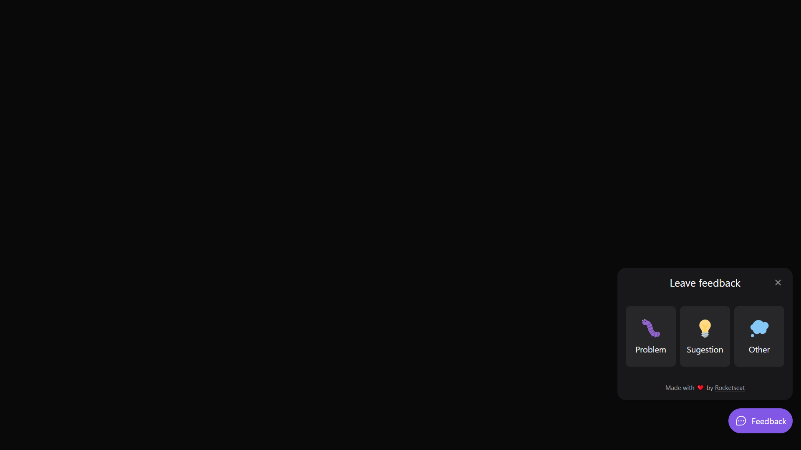

# [Next Level Week 08](https://nextlevelweek.com/)

**NLW Return - _Mission:_ Impulse**  

## Table of Contents:

- [Overview](https://github.com/marcelosperalta/bootcamp_rocketseat/tree/master/nlw_08#overview)
- [Stage 1](https://github.com/marcelosperalta/bootcamp_rocketseat/tree/master/nlw_08#stage-1---02052022---frontend---react---instructor-diego-fernandes)
- [Stage 2](https://github.com/marcelosperalta/bootcamp_rocketseat/tree/master/nlw_08#stage-2---03052021---frontend---react---instructor-diego-fernandes)
- [Stage 3](https://github.com/marcelosperalta/bootcamp_rocketseat/tree/master/nlw_08#stage-3---04052021---backend---nodejs---instructor-diego-fernandes)
- [Run](https://github.com/marcelosperalta/bootcamp_rocketseat/tree/master/nlw_08#run)

## Overview

**_app layout_**  

- https://www.figma.com/community/file/1102912516166573468  

**_app repo_**  

- https://github.com/rocketseat-education/nlw-return-impulse  

**_app name_**  

- Feedback Widget

**_app versions_**  

- web

- mobile

**_app description_**  

- A widget to collect users' feedback that can be used in any application.

**_app features_**  

- It is possible to print the screen and send with the feedback.

**_app screenshot_**  

_web version_  

  

  

### Environment

- Visual Studio Code
  - [Tailwind CSS IntelliSense](https://marketplace.visualstudio.com/items?itemName=bradlc.vscode-tailwindcss)
- Node + NPM

#### update [Node.js](https://nodejs.org/en/)

https://nodejs.org/en/  

```
node -v
```

#### update [NPM](https://www.npmjs.com/package/npm)

```
npm install npm@latest -g
```

```
npm -v
```

#### update [Yarn](https://yarnpkg.com/)

```
yarn set version stable
```

```
yarn -v
```

### Tech Stack

- TypeScript
- React
  - [Vite](https://vitejs.dev/)
- React Native
  - [Expo](https://expo.dev/)
- Node.js
  - Express
  - cors
  - Nodemailer
- SQLite
  - Prisma
- Jest
  - [ts-node](https://typestrong.org/ts-node/)
  - [SWC](https://swc.rs/)

#### Tools

- [Tailwind CSS](https://tailwindcss.com/)
- [Headless UI](https://headlessui.dev/)
- [Phosphor Icons](https://phosphoricons.com/)
- [Insomnia](https://insomnia.rest/)
- [Mailtrap](https://mailtrap.io/)

<hr />

## Stage 1 - 02.05.2022 - Frontend - React - _Instructor: [Diego Fernandes](https://github.com/diego3g)_

### topics

- SPA
- React
  - Component
  - Props
- Tailwind CSS
- Web accessibility
- PopOver

### web app version

#### :file_folder: web folder

##### [Vite](https://vitejs.dev/)

- _install_

  ```
  npm create vite@latest
  ```

  project name: _web_  

  used _react-ts_ option  

- _start_

  ```
  cd web
  ```

  ```
  npm install
  ```

  ```
  npm run dev
  ```

  http://localhost:3000/  

##### [Tailwind CSS](https://tailwindcss.com/)

- _install_

  https://tailwindcss.com/docs/installation/using-postcss  

  ```
  npm install -D tailwindcss postcss autoprefixer
  ```

  ```
  npx tailwindcss init
  ```

  postcss.config.js
  ```
  module.exports = {
      plugins: {
        tailwindcss: {},
        autoprefixer: {},
      }
  }
  ```

  tailwind.config.js
  ```
  module.exports = {
    content: ["./src/**/*.tsx"],
    theme: {
      extend: {},
    },
    plugins: [],
  }
  ```

  src/global.css
  ```
  @tailwind base;
  @tailwind components;
  @tailwind utilities;
  ``

##### [Phosphor Icons](https://phosphoricons.com/)

- _install_

  https://github.com/phosphor-icons/phosphor-home#react  

  https://github.com/phosphor-icons/phosphor-react  

  ```
  npm install phosphor-react
  ```

##### [Headless UI](https://headlessui.dev/)

- _install_

  https://headlessui.dev/react/popover  

  ```
  npm install @headlessui/react
  ```

<hr />

## Stage 2 - 03.05.2021 - Frontend - React - _Instructor: [Diego Fernandes](https://github.com/diego3g)_

### topics

- Widget Form
- Feedback component

### web app version

#### :file_folder: web folder

##### [Tailwind CSS Forms Pluging](https://tailwindcss.com/docs/plugins#forms)

- _install_

  https://github.com/tailwindlabs/tailwindcss-forms  

  ```
  npm install -D @tailwindcss/forms
  ```

  tailwind.config.js
  ```
  module.exports = {
    theme: {
      // ...
    },
    plugins: [
      require('@tailwindcss/forms'),
      // ...
    ],
  }
  ```

##### [Scrollbar Plugin for Tailwind CSS](https://www.npmjs.com/package/tailwind-scrollbar)

- _install_

  https://github.com/adoxography/tailwind-scrollbar  

  ```
  npm install --save-dev tailwind-scrollbar
  ```
  
  tailwind.config.js
  ```
  module.exports = {
    theme: {
      // ...
    },
    plugins: [
      // ...
      require('tailwind-scrollbar'),
    ],
  }
  ```

##### [html2canvas](https://html2canvas.hertzen.com/)

- _install_

  ```
  npm install --save html2canvas
  ```

## Stage 3 - 04.05.2021 - Backend - Node.js - _Instructor: [Diego Fernandes](https://github.com/diego3g)_

### topics

- Database
- SOLID
  - (S)ingle-Responsability principle: Every class should have only one responsibility.
  - (O)pen-Closed principle: Software entities should be open for extension, but closed for modification.
  - (L)skov substitution principle: Functions that use pointers or references to base classes must be able to use objects of derived classes without knowing it.
  - (I)nterface segregation principle: Many client-specific interfaces are better than one general-purpose interface.
  - (D)ependency inversion principle: Depend upon abstractions, (not) concretions.
- Repository Pattern
- Design by contract
- Automated testing
- Unit testing
- Jest (Jest Spy)
- cors

### web app version

#### :file_folder: server folder

```
npm init -y
```

##### TypeScript + @types + [ts-node-dev](https://github.com/wclr/ts-node-dev)

- _install_

  ```
  npm i typescript @types/node ts-node-dev -D
  ```

  ```
  npx tsc --init
  ```

  tsconfig.json
  ```
  ...
  "target": "es2020",
  ...
  "rootDir": "./src", 
  ...
  "outDir": "./dist",
  ...
  ```

  ```
  npx tsc
  ```

##### [Express](https://expressjs.com/)

- _install_

  ```
  npm i express @types/expre
  ```

  ```
  npm i -D @types/express
  ```

##### [Prisma](https://www.prisma.io/)

- _install_

  ```
  npm i prisma -D
  ```

  ```
  npm i @prisma/client
  ```

  ```
  npx prisma init
  ```

  prisma/schema.prisma
  ```
  ...
  datasource db {
    provider = "sqlite"
  ...
  ```

  .env
  ```
  ...
  DATABASE_URL="file:./dev.db"
  ...
  ```

- _create tables_

  ```
  npx prisma migrate dev
  ```

- _to see the tables_

  ```
  npx prisma studio
  ```

  http://localhost:5555  

##### [Nodemailer](https://nodemailer.com/)

- _install_

  ```
  npm install nodemailer
  ```

  ```
  npm install @types/nodemailer -D
  ```

##### [Jest](https://jestjs.io/)

- _install_

  ```
  npm install jest -D
  ```

  ```
  npx jest --init
  ```

  > node  

  > v8  

  ```
  npm i @types/jest -D
  ```

  [ts-node](https://typestrong.org/ts-node/)
    ```
    npm install ts-node -D
    ```
  
  [SWC](https://swc.rs/)

    https://swc.rs/docs/usage/jest  

    ```
    npm i -D @swc/core @swc/jest
    ```

    jest.config.ts
    ```
    transform: {
        "^.+\\.(t|j)sx?$": ["@swc/jest"],
    },
    ```

- _run_

  ```
  npm run test
  ```

##### [cors](https://github.com/expressjs/cors)

- _install_

  ```
  npm i cors
  ```

  ```
  npm i @types/cors -D
  ```

## Stage 5 - 05.05.2021 - Mobile - React Native - _Instructor: [Rodrigo Gonçalves](https://github.com/rodrigorgtic)_

### topics

- Mobile app
  - Android > Java/Kotlin > Build (APK)
  - iOS > Object-C/Swift > Build (IAP)
  - Android/iOS > JavaScript > Js Bundle > APK/IPA
- React Native
- Expo

### mobile app version

#### :file_folder: mobile folder

##### [Expo](https://expo.dev/)

- _install_

  ```
  npm install -g expo-cli
  ```

  ```
  expo --version
  ```

  ```
  expo init mobile
  ```

  > blank (TypeScript)  

- _install_ [Expo Go](https://expo.dev/client) on your mobile phone

  Android  
  https://play.google.com/store/apps/details?id=host.exp.exponent&hl=pt_BR&gl=US

  iOS  
  https://apps.apple.com/br/app/expo-go/id982107779

 - _optional_ - run using emulators

  Adroid Studio  
  https://developer.android.com/studio

  iOS Xcode
  https://developer.apple.com/xcode/

- _run_ 

  ```
  expo start
  ```

  http://localhost:19002/  

##### [R Component](https://marketplace.visualstudio.com/items?itemName=rodrigorgtic.rcomponent)

  https://marketplace.visualstudio.com/items?itemName=rodrigorgtic.rcomponent  

##### [Expo Fonts](https://docs.expo.dev/guides/using-custom-fonts/)

  ```
  expo install expo-font @expo-google-fonts/inter
  ```

##### [SplashScreen](https://docs.expo.dev/versions/latest/sdk/splash-screen/)

  ```
  expo install expo-splash-screen
  ```

## Run

### Frontend

```
cd web
```

```
npm install
```

```
npm run dev
```

http://localhost:3000/  

### Backend

```
cd server
```

```
npm install
```

```
npm run dev
```

http://localhost:3333/  