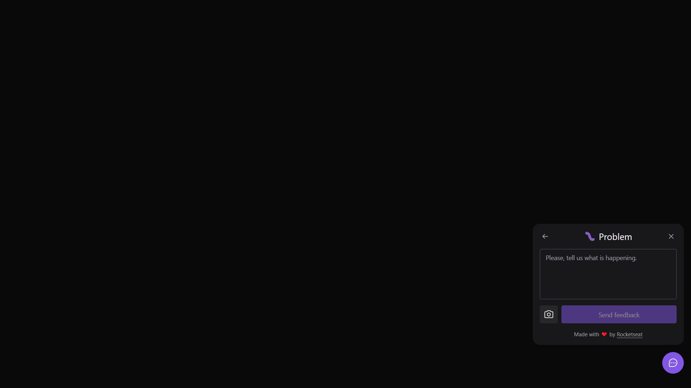

# [Next Level Week 08](https://nextlevelweek.com/)

**NLW Return - _Mission:_ Impulse**  

## Table of Contents:

- [Overview](https://github.com/marcelosperalta/bootcamp_rocketseat/tree/master/nlw_08#overview)
- [Stage 1](https://github.com/marcelosperalta/bootcamp_rocketseat/tree/master/nlw_08#stage-1---02052022---frontend---react---instructor-diego-fernandes)
- [Stage 2](https://github.com/marcelosperalta/bootcamp_rocketseat/tree/master/nlw_08#stage-2---03052021---frontend---react---instructor-diego-fernandes)
- [Run](https://github.com/marcelosperalta/bootcamp_rocketseat/tree/master/nlw_08#run)

## Overview

**_app layout_**  

- https://www.figma.com/community/file/1102912516166573468  

**_app repo_**  

- https://github.com/rocketseat-education/nlw-return-impulse  

**_app name_**  

- Feedback Widget

**_app versions_**  

- web

- mobile

**_app description_**  

- A widget to collect users' feedback that can be used in any application.

**_app features_**  

- It is possible to print the screen and send with the feedback.

**_app screenshot_**  

_web version_  

  

  

### Environment

- Visual Studio Code
  - [Tailwind CSS IntelliSense](https://marketplace.visualstudio.com/items?itemName=bradlc.vscode-tailwindcss)
- Node + NPM
- Yarn

#### update [Node.js](https://nodejs.org/en/)

https://nodejs.org/en/  

```
node -v
```

#### update [NPM](https://www.npmjs.com/package/npm)

```
npm install npm@latest -g
```

```
npm -v
```

#### update [Yarn](https://yarnpkg.com/)

```
yarn set version stable
```

```
yarn -v
```

### Tech Stack

- TypeScript
- React
  - [Vite](https://vitejs.dev/)
- React Native
- Node.js
  - Express
  - Nodemailer
- SQLite
  - Prisma


#### Tools

- [Tailwind CSS](https://tailwindcss.com/)
- [Headless UI](https://headlessui.dev/)
- [Phosphor Icons](https://phosphoricons.com/)
- [Insomnia](https://insomnia.rest/)
- [Mailtrap](https://mailtrap.io/)

<hr />

## Stage 1 - 02.05.2022 - Frontend - React - _Instructor: [Diego Fernandes](https://github.com/diego3g)_

### topics

- SPA
- React
  - Component
  - Props
- Tailwind CSS
- Web accessibility
- PopOver

### web app version

#### :file_folder: web folder

##### [Vite](https://vitejs.dev/)

- _install_

  ```
  npm create vite@latest
  ```

  project name: _web_  

  used _react-ts_ option  

- _start_

  ```
  cd web
  ```

  ```
  npm install
  ```

  ```
  npm run dev
  ```

  http://localhost:3000/  

##### [Tailwind CSS](https://tailwindcss.com/)

- _install_

  https://tailwindcss.com/docs/installation/using-postcss  

  ```
  npm install -D tailwindcss postcss autoprefixer
  ```

  ```
  npx tailwindcss init
  ```

  postcss.config.js
  ```
  module.exports = {
      plugins: {
        tailwindcss: {},
        autoprefixer: {},
      }
  }
  ```

  tailwind.config.js
  ```
  module.exports = {
    content: ["./src/**/*.tsx"],
    theme: {
      extend: {},
    },
    plugins: [],
  }
  ```

  src/global.css
  ```
  @tailwind base;
  @tailwind components;
  @tailwind utilities;
  ``

##### [Phosphor Icons](https://phosphoricons.com/)

- _install_

  https://github.com/phosphor-icons/phosphor-home#react  

  https://github.com/phosphor-icons/phosphor-react  

  ```
  npm install phosphor-react
  ```

##### [Headless UI](https://headlessui.dev/)

- _install_

  https://headlessui.dev/react/popover  

  ```
  npm install @headlessui/react
  ```

<hr />

## Stage 2 - 03.05.2021 - Frontend - React - _Instructor: [Diego Fernandes](https://github.com/diego3g)_

### topics

- Widget Form
- Feedback component

### web app version

#### :file_folder: web folder

##### [Tailwind CSS Forms Pluging](https://tailwindcss.com/docs/plugins#forms)

- _install_

  https://github.com/tailwindlabs/tailwindcss-forms  

  ```
  npm install -D @tailwindcss/forms
  ```

  tailwind.config.js
  ```
  module.exports = {
    theme: {
      // ...
    },
    plugins: [
      require('@tailwindcss/forms'),
      // ...
    ],
  }
  ```

##### [Scrollbar Plugin for Tailwind CSS](https://www.npmjs.com/package/tailwind-scrollbar)

- _install_

  https://github.com/adoxography/tailwind-scrollbar  

  ```
  npm install --save-dev tailwind-scrollbar
  ```
  
  tailwind.config.js
  ```
  module.exports = {
    theme: {
      // ...
    },
    plugins: [
      // ...
      require('tailwind-scrollbar'),
    ],
  }
  ```

##### [html2canvas](https://html2canvas.hertzen.com/)

- _install_

  ```
  npm install --save html2canvas
  ```

## Stage 3 - 04.05.2021 - Backend - Node.js - _Instructor: [Diego Fernandes](https://github.com/diego3g)_

### topics

- SOLID
- Automated testing
- Database

### web app version

#### :file_folder: server folder

```
npm init -y
```

##### TypeScript + @types + [ts-node-dev](https://github.com/wclr/ts-node-dev)

- _install_

  ```
  npm i typescript @types/node ts-node-dev -D
  ```

  ```
  npx tsc --init
  ```

  tsconfig.json
  ```
  ...
  "target": "es2020",
  ...
  "rootDir": "./src", 
  ...
  "outDir": "./dist",
  ...
  ```

  ```
  npx tsc
  ```

##### [Express](https://expressjs.com/)

- _install_

  ```
  npm i express @types/expre
  ```

  ```
  npm i -D @types/express
  ```

##### [Prisma](https://www.prisma.io/)

- _install_

  ```
  npm i prisma -D
  ```

  ```
  npm i @prisma/client
  ```

  ```
  npx prisma init
  ```

  prisma/schema.prisma
  ```
  ...
  datasource db {
    provider = "sqlite"
  ...
  ```

  .env
  ```
  ...
  DATABASE_URL="file:./dev.db"
  ...
  ```

- _create tables_

  ```
  npx prisma migrate dev
  ```

- _to see the tables_

  ```
  npx prisma studio
  ```

  http://localhost:5555  

##### [Nodemailer](https://nodemailer.com/)

- _install_

  ```
  npm install nodemailer
  ```

  ```
  npm install @types/nodemailer -D
  ```

## Run

### Frontend

```
cd web
```

```
npm install
```

```
npm run dev
```

http://localhost:3000/  

### Backend

```
cd server
```

```
npm install
```

```
npm run dev
```

http://localhost:3333/  